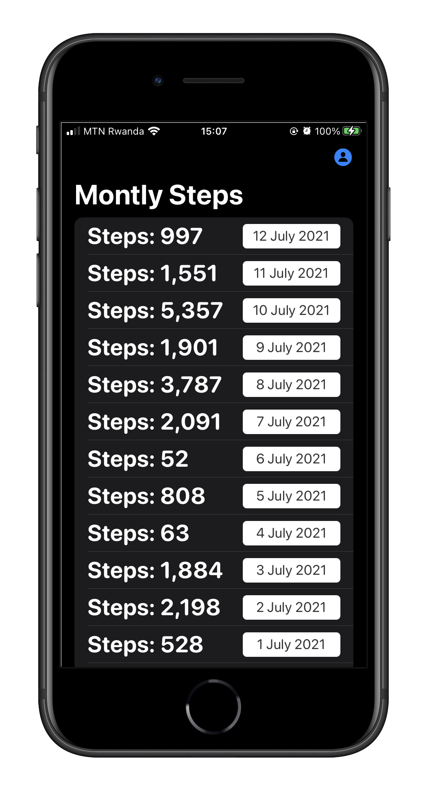

# Healthy
An exploration of HealthKit framework

### Tech & Tools:

- SwiftUI
- HealthKit
- CoreMotion (`CMPedometer`)
- Widgets

## TakeAways 🚀

- **Understand Widgets and their usage**
- **Understand how HealthKit works and when/how to use it**

## Special Thanks to:

1. [Esther Carelle](https://github.com/esthcarelle) for her wonderful feedback✨.

### Features:

 - Monthly Steps Count
 - Body Mass, age, Blood Type

Home View                 |  Profile View
:-------------------------:|:-------------------------:
  |  
